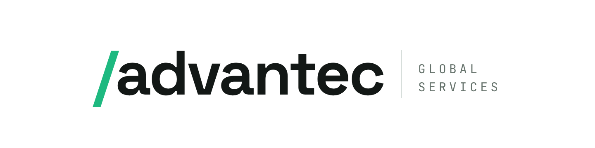

  <picture>
    <source media="(prefers-color-scheme: dark)" srcset="assets/advantec-logo-dark.png">
    
  </picture>

**Enterprise IT, delivered without drama.**

We design, deploy, and manage your digital workspace. Since 1994, Advantec has helped organizations solve pressing business challenges — starting as a regional provider in the Southeast United States and growing into a global consulting partner for IT decision-makers.

## What we do

- **End user computing** — we plan, build, and run the digital workspaces your people rely on every day
- **Networking** — enterprise network design, deployment, and management
- **Cloud** — migrations and operations across Azure, AWS, and GCP: landing zones, identity, workloads, and the runbook your team keeps
- **Automation** — practical automation that reduces toil and keeps environments consistent
- **Training** — EUC-focused training so your team owns what we build together

## How we work

You get the personal attention of a local firm with the expertise and pricing power of an industry leader. Our engineers bring `30+` years of practiced, implemented experience — and an unwavering commitment to honesty and integrity in every engagement.

## Who we work with

Our clients span industries and sizes: legal firms, multi-national corporations, financial services, retail, manufacturing, and healthcare.

## Partners

Microsoft · AWS · Citrix · Google · VMware · Parallels

---

[www.advantec.us](https://www.advantec.us)
